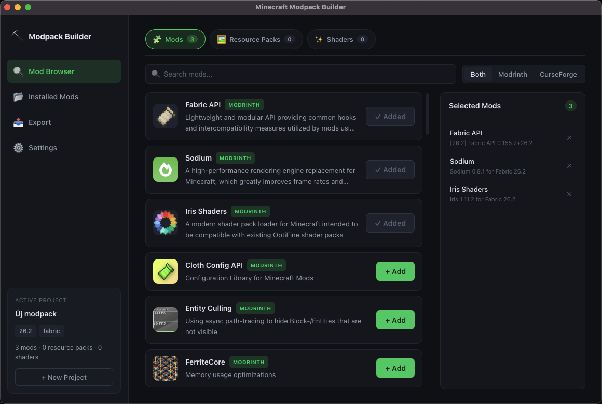

# Minecraft Modpack Builder

A desktop app for building Minecraft modpacks: search [Modrinth](https://modrinth.com) and [CurseForge](https://www.curseforge.com) for mods, resource packs, and shaders — filtered to what's actually compatible with your chosen Minecraft version and mod loader — then scan an existing install for outdated mods and export a ready-to-use pack.



## Features

- **Search Modrinth and CurseForge** for mods, resource packs, and shaders, filtered by Minecraft version and mod loader (Forge / Fabric / NeoForge / Quilt)
- **Scan a local `mods/` folder** to find outdated or incompatible mods, using the same hash-based file identification the official CurseForge app uses
- **Export** to:
  - a plain `mods/` / `resourcepacks/` / `shaderpacks/` folder structure, for launchers with no modpack-format support (TLauncher, the official Minecraft launcher)
  - `.mrpack` (Modrinth pack format), importable into Prism Launcher and other compatible launchers
  - a CurseForge modpack zip, importable into the CurseForge app
- **Multi-language UI** — English, Magyar, Deutsch, Español (more can be added easily)
- Your CurseForge API key is encrypted at rest via Electron's `safeStorage` and never leaves your machine

## Installing

Download the latest Windows build from the [Releases](../../releases) page.

On macOS, build it yourself from source (see below) — only the Windows build is published.

## Getting a CurseForge API key

CurseForge search requires a free **Core API key**:

1. Go to [console.curseforge.com](https://console.curseforge.com/) and sign in
2. Request/create an API key under **API Keys**
3. Paste it into the app's **Settings** screen — it's stored encrypted, never committed or logged

Modrinth search works out of the box with no key required.

## Development

Requires Node.js 20+.

```bash
npm install
npm run dev
```

### Build

```bash
npm run build:win     # Windows
npm run build:mac     # macOS
npm run build:linux   # Linux
```

### Type-check

```bash
npm run typecheck
```

## Tech stack

Electron + [electron-vite](https://electron-vite.org/), React, TypeScript, Zustand, TanStack Query, react-i18next.

All network calls (Modrinth/CurseForge APIs) run in the main process; the renderer talks to it through a typed `contextBridge` preload API.

## License

[MIT](LICENSE)
